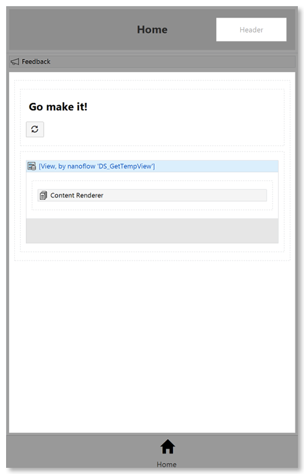
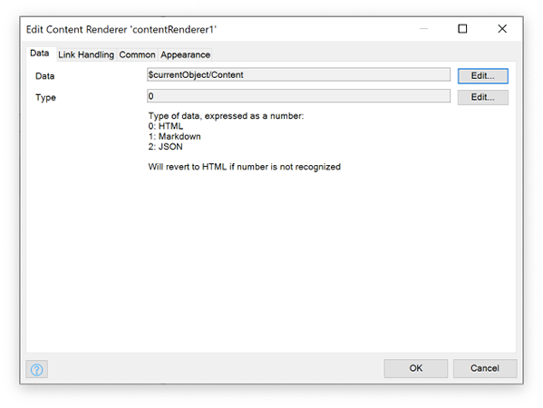
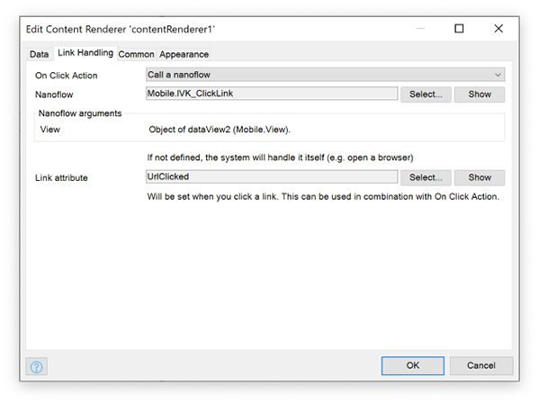
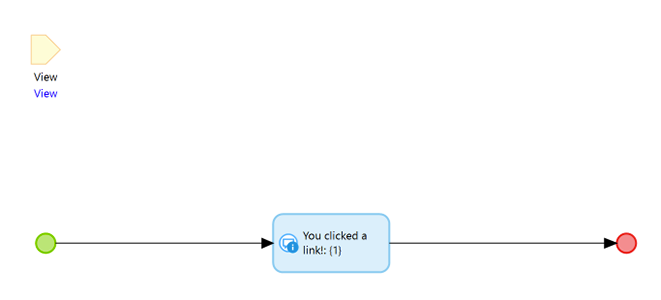

[](http://www.apache.org/licenses/LICENSE-2.0)
[-orange.svg)](https://docs.mendix.com/developerportal/app-store/app-store-content-support)
[](https://appstore.home.mendix.com/link/modeler/)
[](https://github.com/JelteMX/mendix-native-content-renderer/releases/latest)
[](https://github.com/JelteMX/mendix-native-content-renderer/issues)
# Mendix Native Content Renderer


Do you want to render HTML or Markdown in your Mendix Native app? Want to display a JSON?

[](/assets/overview-big.png)

It uses the following libraries to do so:

- [react-native-render-html](https://www.npmjs.com/package/react-native-json-tree) (6.3.4) - [Official website](https://meliorence.github.io/react-native-render-html/)
  - Renders HTML in your React Native app
- [marked](https://www.npmjs.com/package/react-native-json-tree) (4.0.12) - [Official website](https://marked.js.org/)
  - Converts Markdown to HTML, then renders the HTML using the previous package
  - Supports almost all [GFM and Commonmark](https://github.com/markedjs/marked/discussions/1202#discussioncomment-1907552)
- [react-native-json-tree](https://www.npmjs.com/package/react-native-json-tree) (1.3.0)
  - Renders a JSON tree in your application

## Features

- Render HTML
- Render Markdown
- Custom link handler for HTML/Markdown
- Render JSON
## Usage

### Data

- Select your Source, this should be a String, containing HTML/Markdown/JSON
- Select your Type, this is a number
  - 0 = HTML
  - 1 = Markdown
  - 2 = JSON
  - If it does not recognize the number, it will revert to `HTML`

### Link handling

> Only applies to HTML/Markdown

- Upon clicking a link, you can let the widget decide what to do:
  - If you select an Action, that will be used by the widget when you click any hyperlink
  - If you do not select an Action, it will let the system handle it (e.g. open a link in a browser)
- Link Attribute can be used (preferably in a non-persistent Entity) to pass the link to your nanoflow. That way you have total control over what you do with any link.
  - Note: Make sure the attribute and entity is editable. The widget will **not** give you an error when it is not editable.

## Styling

Styling is done in normal [Mendix Native Styling](https://docs.mendix.com/refguide/native-styling-refguide) procedures.

Class: `com_mendixlabs_widget_native_contentrenderer_ContentRenderer`

Default styling:

```js
export const com_mendixlabs_widget_native_contentrenderer_ContentRenderer = {
    html: {
        container: {

        },
        base: {
            color: "#444"
        },
        tags: {
            p: {
                marginTop: 0,
                marginBottom: 3
            }
        },
        ids: {},
        classes: {}
    },
    json: {
        container: {
            flex: 1
        },
        theme: {
            base00: "#000000",
            base01: "#303030",
            base02: "#505050",
            base03: "#b0b0b0",
            base04: "#d0d0d0",
            base05: "#e0e0e0",
            base06: "#f5f5f5",
            base07: "#ffffff",
            base08: "#fb0120",
            base09: "#fc6d24",
            base0A: "#fda331",
            base0B: "#a1c659",
            base0C: "#76c7b7",
            base0D: "#6fb3d2",
            base0E: "#d381c3",
            base0F: "#be643c"
        }
    }
};
```

The widget's style properties are as follows:

```xml
<root>
    <html>
        <container />
        <base />
        <tags />
        <ids />
        <classes />
    </html>
    <json>
        <container />
        <theme />
    </json>
</root>
```

> Note: Markdown renderer uses the same styling as HTML

| Element | Style Properties | Description |
| - | - | - |
| `html/container` | This has all ViewStyle properties | |
| `html/base` | Styles root component | See [here](https://meliorence.github.io/react-native-render-html/docs/guides/styling#props) |
| `html/tags` | Target elements by tag name | See [here](https://meliorence.github.io/react-native-render-html/docs/guides/styling#props) |
| `html/ids` | Target elements with `id` attribute | See [here](https://meliorence.github.io/react-native-render-html/docs/guides/styling#props) |
| `html/classes` | Target elements with `class` attribute | See [here](https://meliorence.github.io/react-native-render-html/docs/guides/styling#props) |
| `json/container` | This has all ViewStyle properties |  |
| `json/theme` | [base16 color scheme](https://github.com/chriskempson/base16) | [See this documentation](https://github.com/Dean177/react-native-json-tree#theming) |

## Example (with onClick Event)

Consider the following scenario:

1. We have a **non-persistent View** entity, which has two attributes: **Content** & **UrlClicked**



2. We configure the widget as follows:



On click we execute a Nanoflow (IVK_ClickLink), which has the same View object as an input parameter. We also configure our Link Attribute to UrlClicked.



3. Nanoflow



4. What happens?

- Let's say we have a text with `<p>This is a text with a <a href="link1">link</a></p>`. Notice the `href`
- The user clicks this link
- The widget will set the Link Attribute (in our example **UrlClicked**) to `link1`
- It will execute the **IVK_ClickLink** nanoflow, where we can retrieve the `href` contents (in this example `link1`) from the **UrlClicked** attribute

## Issues, suggestions and feature requests

> This widget is **NOT** officially supported by Mendix

Report your issues on Github, see [here](https://github.com/JelteMX/mendix-native-content-renderer/issues)

## Development and contribution

1. Install NPM package dependencies by using: `npm install`. If you use NPM v7.x.x, which can be checked by executing `npm -v`, execute: `npm install --legacy-peer-deps`.
1. Run `npm start` to watch for code changes. On every change:
    - the widget will be bundled;
    - the bundle will be included in a `dist` folder in the root directory of the project;
    - the bundle will be included in the `deployment` and `widgets` folder of the Mendix test project.

## License

Apache-2
